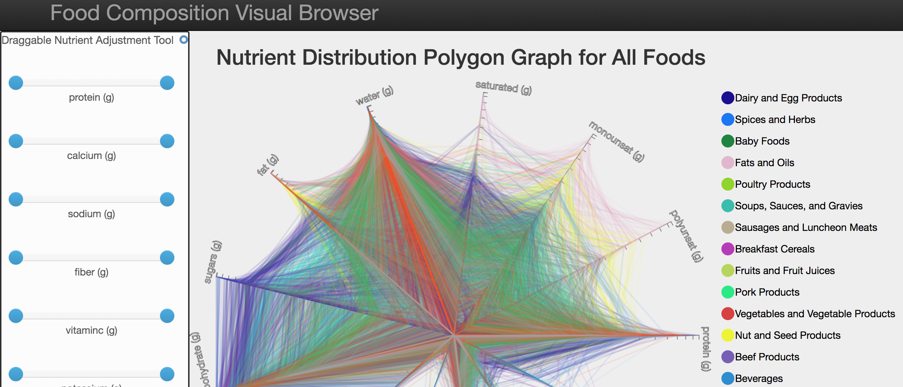

# USDA Food Composition Visual Browser

## What's our problem?
Nowaday people care about food choice and diet to keep good health.  

The USDA National Nutrient Database is the standard reference for nutritional contents of food in the United States. 
However, it is always hard for customers to find the nutrition distribution of the food exactly and which kind of food 
they want based on their plan. Also comparison of nutritions among foods is more complicated. In order to solve this problem, 
we build a visualization system to decode the data and visualize the data sheet from USDA.

* [Play Me!](https://ll10524.github.io/USDA-Food-Visualization-Tool/dashboard-page/)

## Data Source
[USDA Food Composition](https://ndb.nal.usda.gov/ndb/search/list)

## How to use our system?
* First, the middle polygon graph is the main graph. Each line that forms a polygon is a food. 
The different color represents different food group.

* The color of the food group is defined on the right side. There are 25 group to categorize the food.

* If user do not have particular interest in any food. We suggest he can click on any of the food group on the right. 
Once he select click on a food group, the selected food group will be highlighted in the main graph.

* The left side is filter section. Each scroll bar is a filter for a certain nutrient. User can use the filter to limit 
the number of polygons shown in the main graph. 

* In the lower image, there is a food list in the left. The food in the food list is corresponding to polygon shown in 
the graph. If user select a food in the list, the information for detail nutrient composition will be shown with a pie chart. 

* Also, this selected food will be shown in the right scatter plot and highlighted with bigger circle enclosed with black 
border. Two nutrients can assigned to the x-axis and y-axis to see the relationship between these two nutrients. 
The circles in the scatter plot is corresponding to the food list and also the main plot while color is mapped with the 
legend in the upper right.

## Links
* [Final Project Report](https://drive.google.com/file/d/0B0md3S9CvhRRLXdxZGtVWEg0Vjg/view)
